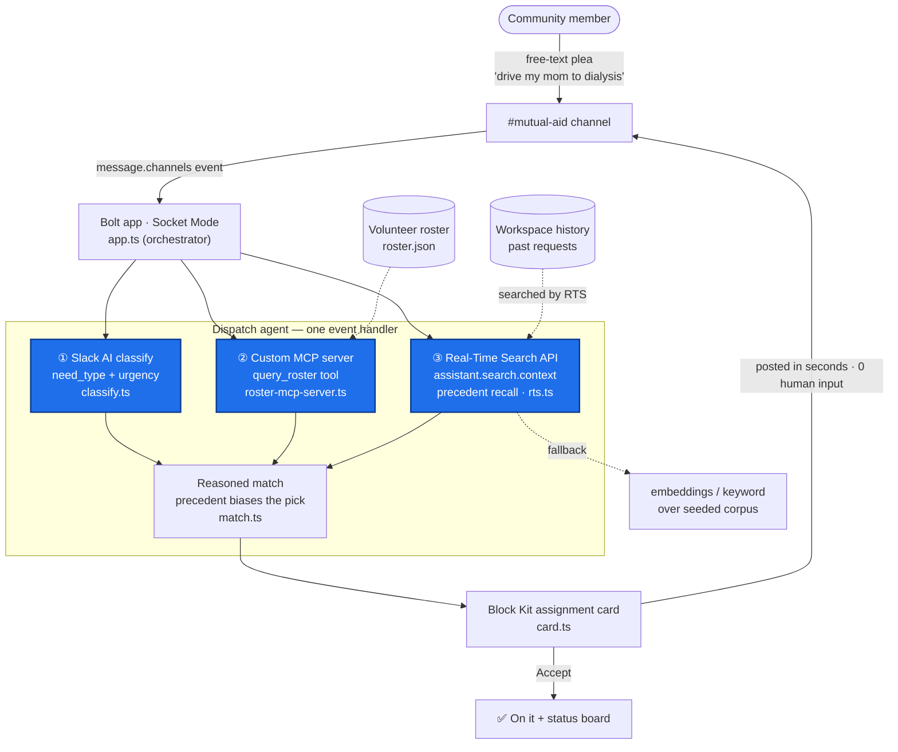

# Dispatch — architecture

A community member posts a free-text plea in a Slack channel. With **zero human input**, a Bolt
agent classifies it, finds candidate volunteers, recalls who handled similar requests before, and
posts a Block Kit assignment card back to the channel — in seconds.

The agent uses **all three** required Slack technologies in a single event handler.

## The three required technologies
| # | Technology | Role in Dispatch | Source |
|---|---|---|---|
| ① | **Slack AI** | Classifies the free-text plea → `need_type` + `urgency` | `src/classify.ts` |
| ② | **MCP server integration** | Custom MCP server exposes the volunteer roster as a `query_roster` tool the agent calls | `src/roster-mcp-server.ts`, `src/mcp-client.ts` |
| ③ | **Real-Time Search API** | `assistant.search.context` recalls who handled similar past requests from workspace history | `src/rts.ts` |

The **reasoned match** (`src/match.ts`) is the key: the RTS-recalled precedent *biases which volunteer
is chosen*, not just what the card says — so the agent shows judgment grounded in the workspace's own history.
